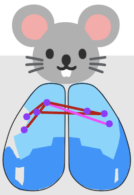

# Widefield Calcium Imaging Analysis
Parent project linking modular pipelines for mesoscale Ca²⁺ imaging analyses:
- peak amplitudes/latencies
- Pearson modularity connectivity (PCA + dendrograms, heatmaps)
- wavelet power & adaptation (with supervised prediction)
- Allen atlas coefficient barplots
- behavior state extraction
- supplemental materials

  

See `docs/` for weekly guide and plan. Each subfolder contains its own README.
