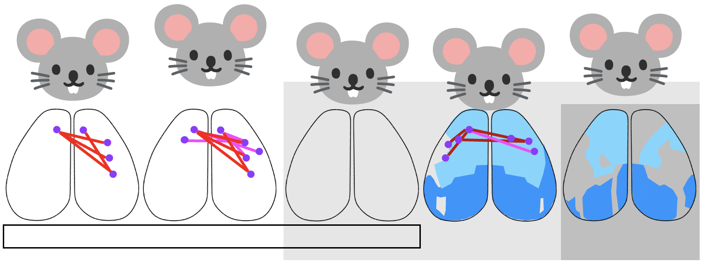

# Widefield Calcium Imaging Analysis

Widefield calcium imaging is a time-resolved optical imaging approach designed to assess large scale brain responses and
dynamics in awake behaving mice. See this comprehensive review: [Cardin et al. 2020](https://doi.org/10.1016/j.neuron.2020.09.031) 

This repository (under construction 🚧 and) is the parent project linking the following analysis pipelines for mesoscale Ca²⁺ imaging analyses:
- Common core atlas version 3 coefficient barplots (folder: allen_atlas_barplots)
- Behavior state metrics and predictions (folder: behavior_state)
- Evoked response peak amplitudes and latencies (folder: peak_amplitude_latency)
- Pearson modularity connectivity (PCA + dendrograms, heatmaps, circle plots) (folder:pearson_modularity_connectivity)
- Supplemental materials (folder: supplemental)

The associated publication is: Parker EM, et al. (2026) URL forthcoming

  

See `docs/` for other documentation. Each subfolder contains its own README
and hypothesis testing unless otherwise noted.
